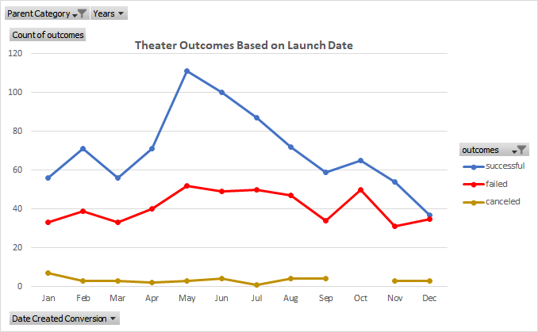
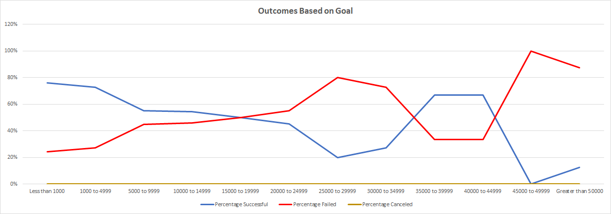

# Kickstarting with Excel

## Overview of Project

### Purpose

The purpose of this project is to provide data for Louise based on how other kickstarter plays have fared in relation to their launch dates and their funding goals.

## Analysis and Challenges

I used the raw data of kickstarters and created two new columns titled Date Created Conversion and Date Ended Conversion (S and T) to convert the Unix timestamps from columns I and J to make sure both dates can be easily read. Afterwards, I created an additional column (U) titled Years to separate the years from the Date Created Conversion column. I made a pivot table titled Outcomes Based on Launch Date in which I filtered the Parent Category for Theaters and looked over successful, failed and canceled outcomes throughout each month within a calendar year. 

Lastly, I created a worksheet titled Outcome Based on Goals which specifically looked at specific ranges of Goal amounts and their Successful, Failed and Canceled outcomes. I initially used the COUNTIF formula set to the data in the Kickstarter worksheet, however it was pulling from all of the data regardless of it being filtered or not. Instead I filtered the Subcategory column in the Kickstarter sheet to Plays only and filtered off Live from the Outcomes column. Once my filters were set, I copied and pasted the data into a separate worksheet titled Plays. I set my COUNTIF formula to the Plays sheet and this resulted in the data being accurate. I took the sum of each row and made percentages based on each outcome so we would have a consistent Succeed vs Fail rate based on the Goal category (there were no canceled outcomes in this dataset).

### Analysis of Outcomes Based on Launch Date

Based on the above chart, we have a timeline from January to December showing the Successful, Failed and Canceled outcomes of theater kickstarters. The top 3 months for starting a Kickstarter appear to be in May, June and July since these months have higher kickstarter totals and higher successful outcomes. On the other hand, December appears to be the worst time to start a theater kickstarter. Based on the date created, May appears to be the best month statistically to start a theater kickstarter.

### Analysis of Outcomes Based on Goals

This chart showcases the Success rate, Failure rate, and Cancel rate for each goal range set starting from less than 1,000 to over 50,000. For most of the chart there is a negative relationship between Goal Amount and Success rate but a positive relationship with the Failure rate. Up until 35000 to 39999 and 40000 to 44999, the greater the goal the lower the success rate becomes. Success rates appear highest with goals set less than 1000 and from 1000 to 4999. The goals set at 35000 to 39999 and 40000 to 44999 may appear to be successful, however the sample size for both categories are very low, with 6 and 3 respectively. While less than 1000 and 1000 to 4999 have a sample size of 186 and 534 respectively, making these numbers more reliable to take action on than the formers.

### Challenges and Difficulties Encountered

The main challenges I encountered from this data set was accurately getting the right numbers for the COUNTIFS formula. As mentioned above, I needed to create a separate worksheet copying and pasting the filtered Plays data and constructing my formula based on it. It took a little time to set the ruleset for the COUNTIFs formula but once I figured it out, I could replicate it with no problem. The only other slight difficulty is the outlier data in the Outcomes Based on Goal chart. Having a small sample size for the 35000 to 39999 and 40000 to 44999 goal amounts makes it appear as if setting goals that high would be a smart decision, however it most likely wouldn't given the the downward trend of success rates.

## Results

Two conclusions I can draw on from the Outcomes based on Launch Date are:
1. May, June and July would be the best months to start a theater kickstarter. 
2. December would be the worst month to start one.

When it comes to Outcomes based on Goals, the downward trend of Success rates leads us to assume the lower the goal amount the higher the success rate will be. Finding a sweetspot for a budget below 5,000 would be best to ensure the play kickstarter will succeed.

Some limitations that this dataset has would be that the sample sizes are not equal which can cause certain data points in charts to appear better when they aren't. As mentioned above the low sample size of the 35000 to 39999 and 40000 to 44999 categories makes it appear that all plays set to these amounts will succeed 67% of the time. The downward trend of success rates contradicts these two data points. We also do not have a way to account for other factors other than time of the year and goal amounts such as the demographics of the people who pledged and the amount of exposure the kickstarters were given. There are also no data points for play canceled outcomes so we could only compare between successful and failed kickstarters.

Along with the charts I created above we could also incorporate a separate line graph for the plays subcategory so we can compare that chart with the Theaters chart. We could also create pie charts for specific goal ranges to give a better visual of the success vs fail rate of each goal range.

